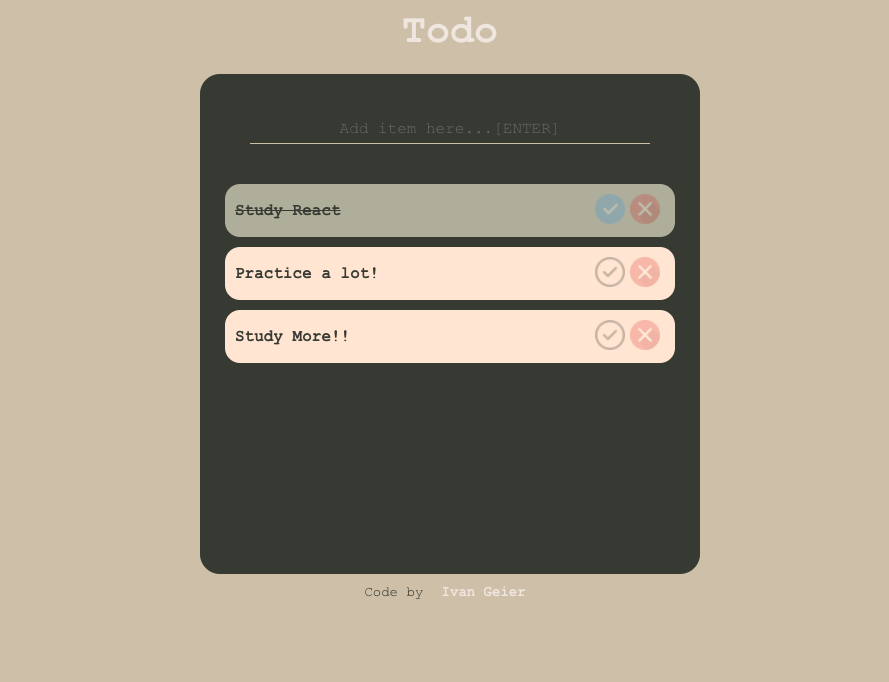

# TODO Application

This is my first application with React. Use this project to understand the basics of React and how to work with components.

## How to Run

- Clone the project to your computer
- Go to the project folder and run the application with the command line

```
'npm instal' // to install all dependecies
'npm start' // to run the application
```

## Technologies

- React
- CSS
- HTML

## Screenshot


